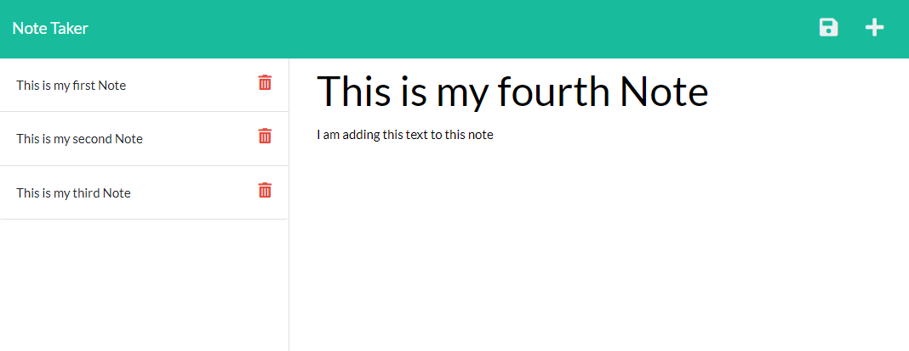

# Note Taker
]

## Description  
A digital notepad is a great way to keep track of random thoughts and reminders one might have throughout the day. The Note Taker application is exactly that.  
A user can type a title for eac note followed by the body portion of the note and save each note to the page. Previous saved notes will render on the left of the page. If a note is no longer desired, the user can choose to delete any note at any time.

## Table of Contents  
[Description](#description)   
[Installation](#installation)  
[Usage](#usage)  
[License](#license)  
[Contributing](#contributing)  
[Tests](#tests)  
[Questions](#questions)  

## Installation  
To run this application you will need to enter 'npm i' to install all project dependencies.

## Usage  
  
This was made for anyone in need of a digital notepad to keep track of notes throughout their day.

## License 
Unlicense
[Link to License](https://unlicense.org/)

## Contributing  
Fellow developers can run through the program and look for ways to speed up the process, any and all critiques are welcome.

## Tests  
Once all packages have been installed, you need to initialize the server by running 'node server.js'. The local server should begin to run and the webpage becomes available.  
Their are two sections you may type in, the title and the text. After both title and text have been filled, an icon will appear in the top right to save the note. All saved notes will be rendered in the column to the left. Saved notes cvan be displayed in the right column once clicked upon. Saved notes can also be deleted by clicking on the trash button on the right side of the note's tab. 

## Questions
Link to github: [Click Here](https://github.com/colinmchale)  
Please submit any additional questions you may have in an email to colin.mchale22@gmail.com